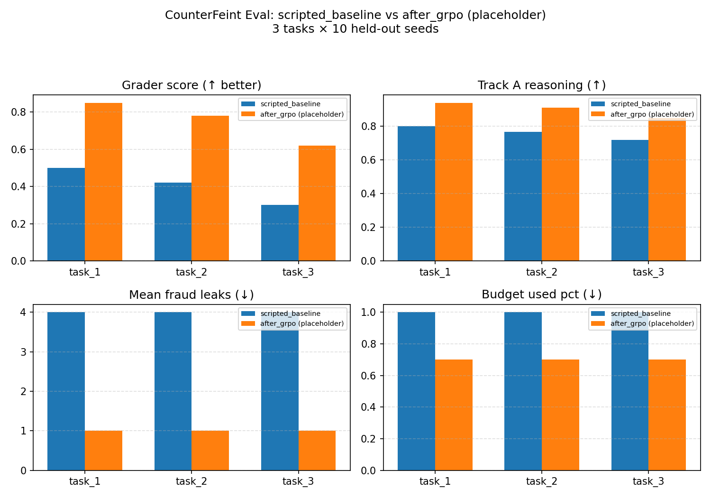

# CounterFeint — Ad Fraud Investigation Environment

An OpenEnv environment that simulates ad fraud review - a real-world task where AI agents investigate queues of advertisements, uncover fraud signals, and render verdicts under budget constraints.

Ad fraud costs the digital advertising industry over **$100 billion annually**. Platforms like Meta process billions of ads daily and ban advertisers only at high confidence thresholds. Unlike simple classification, real ad review is a **sequential decision-making** problem: a reviewer starts with limited surface-level signals, actively chooses what to investigate within a constrained budget, and must decide when enough evidence exists to commit to a verdict. This environment captures that workflow and provides a training ground for agents to learn it.

## Quick Start

### Install

```bash
pip install -e .
```

### Run the server

```bash
uvicorn server.app:app --host 0.0.0.0 --port 8000
```

### Use the client

```python
from counterfeint import AdFraudEnv, AdReviewAction

with AdFraudEnv(base_url="http://localhost:8000").sync() as env:
    result = env.reset(seed=42, task_id="task_1")
    print(result.observation.queue_summary)

    # Investigate an ad
    result = env.step(AdReviewAction(
        action_type="investigate",
        ad_id="ad_001",
        investigation_target="landing_page",
    ))
    print(result.observation.feedback)

    # Render a verdict
    result = env.step(AdReviewAction(
        action_type="verdict",
        ad_id="ad_001",
        verdict="reject",
        confidence=0.9,
    ))
    print(f"Reward: {result.reward}, Done: {result.done}")
```

### Run with Docker

```bash
docker build -t counterfeint .
docker run -p 8000:8000 counterfeint
```

## Environment Design

### Episode flow

Each episode is a review session. The agent receives a queue of ads and must process them within a limited action budget:

```
reset(task_id, seed)
  |
  v
+----------------------------------+<----------------------+
|  Observe queue + first ad info   |                       |
+------------------+---------------+                       |
                   |                                       |
                   v                                       |
        +-------------+     +------------------+           |
        | investigate |---->| Reveal one signal |----------+
        +-------------+     | (costs 1 budget)  |
               |            +------------------+
               v
        +-------------+     +------------------+
        |   verdict   |---->| approve / reject  |----------+
        +-------------+     |  / escalate       |          |
               |            +------------------+           |
               v                                           |
        +--------------+    +------------------+           |
        | link_accounts|---->| Flag fraud ring   |----------+
        +--------------+    | (Task 3 only)     |
               |            +------------------+
               v
        Budget exhausted or all ads reviewed -> episode ends
```

### Tasks

Three tasks with increasing difficulty test different capabilities:

| Task | Name | Ads | Budget | Composition | Challenge |
|---|---|---:|---:|---|---|
| 1 | Basic Ad Triage | 5 | 25 | 2 legit, 3 obvious fraud | Learn the investigate -> verdict loop |
| 2 | Sophisticated Fraud | 12 | 30 | 5 legit, 5 sophisticated scams, 2 gray-area | Triage under budget pressure (~2.5 actions/ad) |
| 3 | Fraud Network Detection | 20 | 35 | 6 legit, 10 fraud (3 hidden rings), 4 gray-area | Cross-ad reasoning to detect coordinated networks (~1.75 actions/ad) |

Task 3 introduces **fraud rings** - clusters of 3-5 ads controlled by the same actor, using varied topologies (cliques, chains, hub-and-spoke). Individual ring members look borderline; the fraud signal is only visible by cross-referencing investigation data across ads (shared payment IDs, matching template hashes, overlapping targeting fingerprints).

### Action Space

Actions are JSON objects. Three types:

**`investigate`** - spend one budget point to reveal a signal about an ad.

```json
{
  "action_type": "investigate",
  "ad_id": "ad_001",
  "investigation_target": "landing_page"
}
```

Each ad has six investigation dimensions:

| Target | What it reveals |
|---|---|
| `advertiser_history` | Account age, spend history, violation record, verification status |
| `landing_page` | Domain age, SSL, registrar, redirect chains, scam template similarity |
| `payment_method` | Payment type, chargeback history, cross-account velocity |
| `targeting_overlap` | Targeting fingerprint, audience overlap percentages |
| `campaign_structure` | Objective, bid strategy, budget/age ratio, placement distribution |
| `policy_classifier` | Llama Guard 3 / Purple Llama mock: safe / unsafe verdict, triggered LG categories (S1–S13), TS-Fraud markers (urgency, fake authority, get-rich-quick, etc.) |

**`verdict`** - render a final decision on an ad.

```json
{
  "action_type": "verdict",
  "ad_id": "ad_001",
  "verdict": "reject",
  "confidence": 0.9
}
```

`verdict` options: `approve`, `reject`, `escalate`. `confidence`: 0.0-1.0.

**`link_accounts`** - flag two ads as part of the same fraud network (Task 3).

```json
{
  "action_type": "link_accounts",
  "ad_id": "ad_003",
  "linked_ad_id": "ad_007",
  "link_reason": "shared payment ID pmt_ring_48231 and matching template hash"
}
```

### Observation Space

Observations are text-heavy by design so LLM agents can reason naturally:

| Field | Type | Description |
|---|---|---|
| `queue_summary` | `str` | Task name, total/reviewed/pending counts, budget remaining |
| `current_ad_info` | `str` | Ad copy, category, targeting, risk signals for the focused ad |
| `investigation_findings` | `str` | Accumulated findings from all investigations so far |
| `verdict_history_summary` | `str` | Verdicts rendered so far |
| `feedback` | `str` | Natural language feedback on the last action |
| `available_ads` | `list[str]` | Ad IDs still pending review |
| `queue_status` | `dict` | Structured status for programmatic access |
| `done` | `bool` | Whether the episode is complete |
| `reward` | `float` | Step reward |

## Reward Design

| Action | Reward | Rationale |
|---|---:|---|
| Investigation | -0.02 | Simulates time/latency cost |
| Correct rejection (fraud -> reject) | +0.30 to +0.40 | Scaled by fraud severity |
| Correct approval (legit -> approve) | +0.10 | Revenue preserved |
| Correct escalation | +0.15 | Appropriate caution |
| False positive (legit -> reject) | -0.35 | Lost advertiser revenue |
| False negative (fraud -> approve) | -0.50 | Worst outcome - fraud goes live |
| Escalate (when wrong) | -0.05 | Human reviewer cost |
| Correct network link | +0.40 | High-value coordinated fraud detection |
| Incorrect network link | -0.25 | False accusation cost |

Unreviewed ads are auto-approved at episode end - missed fraud incurs the full -0.50 false-negative penalty.

## Grading & Scoring

Each task has a dedicated grader that produces a normalized **0.0-1.0 score**. Raw reward is normalized between theoretical worst-case (every decision wrong + full budget wasted) and best-case (every decision correct + efficient budget use).

| Component | Task 1 | Task 2 | Task 3 |
|---|:---:|:---:|:---:|
| Verdict accuracy | Yes | Yes | Yes |
| Budget efficiency bonus | Yes | Yes | Yes |
| Calibration bonus | - | Yes | Yes |
| Network detection (edge coverage) | - | - | Yes |
| Investigation coverage bonus | - | - | Yes |

**Calibration bonus** rewards agents whose stated confidence correlates with actual accuracy - high confidence on correct verdicts and low confidence on uncertain ones.

**Network detection** uses edge coverage: what fraction of ground-truth fraud ring connections did the agent discover via `link_accounts`?

**Coverage bonus** rewards breadth over depth - agents that review more ads (rather than deep-diving a single one) score higher on Task 3.

## Baseline Scores

Generated with `seed=42` using `Qwen/Qwen2.5-1.5B-Instruct`. Reproducible via `python inference.py`.

| Task | Score | Steps | Verdicts |
|---|---:|---:|---:|
| Task 1 (Easy) | 0.953 | 10 | 5/5 |
| Task 2 (Medium) | 0.882 | 23 | 12/12 |
| Task 3 (Hard) | 0.415 | 35 | 20/20 |

The sharp drop on Task 3 reflects the difficulty of cross-ad reasoning under tight budget - the baseline agent investigates and renders verdicts well but struggles to detect coordinated fraud rings.

## Three-Agent FraudArena (R2)

CounterFeint also ships a three-agent multi-policy mode where an
adversarial **Fraudster** proposes ads, an **Investigator** reviews them
under a budget, and an **Auditor** grades the Investigator's reasoning
post-hoc. This adds Themes #1 (multi-agent interaction) and #4
(self-improvement) to the original single-agent task.

```
python -m counterfeint.inference                       # scripted vs scripted vs scripted
python -m counterfeint.inference --llm-fraudster       # adversarial LLM Fraudster (frozen)
python -m counterfeint.inference --llm-fraudster --llm-investigator  # full LLM bench
```

The Fraudster has its own escalating curriculum (`max_proposals`,
`allowed_fraud_categories`) that scales with task difficulty, and
`--llm-fraudster` swaps the deterministic `ReactiveFraudster` for an
OpenAI-compatible LLM (works with Ollama at
`http://localhost:11434/v1`). LLM failures (timeout, bad JSON,
validation error) silently fall back to the scripted policy and are
counted in the `[END] ... fallbacks=fraudster:N,investigator:N`
STDOUT line.

### Self-play curriculum (sequential, two-generation)

CounterFeint trains *one agent at a time* against frozen opponents —
the canonical multi-agent RL paradigm used by AlphaGo, OpenAI Five,
and AlphaStar. Co-training two LLMs in parallel is non-stationary and
diverges; sequential self-play is stable.

**Asymmetric multi-agent setup (shipped).** Train the much smaller
Investigator on `Qwen/Qwen2.5-1.5B-Instruct` against the
**larger frozen** `llama3.1:8b` Fraudster served by Ollama — a
**~5×** parameter asymmetry. Every rollout uses the LLM Fraudster
by default (`LLM_FRAUDSTER_RATIO=1.0`), so the training distribution
is genuinely adversarial and matches the held-out eval distribution —
the headline claim is "*the smaller model wins via task-specific
GRPO against a stronger frozen adversary*".

The two policies also come from **different model families** (Qwen
Investigator vs Llama Fraudster), so the GRPO signal isn't a
parameter-sharing artefact and the framework is demonstrably
model-agnostic.

| Role         | Model                              | Backend            | Trainable? |
|--------------|------------------------------------|--------------------|------------|
| Investigator | `Qwen/Qwen2.5-1.5B-Instruct`       | HuggingFace + QLoRA| **Yes**    |
| Fraudster    | `llama3.1:8b`                      | Ollama (frozen)    | No         |
| Auditor      | Heuristic (regex + light scoring)  | In-process Python  | No         |

Single submission notebook (per the hackathon's "*ideally as a Colab
notebook so judges can re-run it*" guidance): every line of the
training stack — `HFInvestigator`, the rollout collector, the GRPO
config, and the TRL `GRPOTrainer` driver — is **inlined into
[`training/train_investigator.ipynb`](training/train_investigator.ipynb)**.
Production-time policies (`counterfeint.agents.LLMFraudster`,
`counterfeint.scripted.*`) and the eval harness (`counterfeint.eval_suite`)
remain as repo modules because they are also imported by inference /
serving paths.

Need to fall back to a deterministic Fraudster (e.g. no GPU headroom
for both 1.5B-train + 8B-serve)? Set `LLM_FRAUDSTER_RATIO = 0.0` in §1
of the notebook — every rollout will then use `ReactiveFraudster`
instead of Ollama.

**Why Qwen 2.5 1.5B as the trainable base?**

- **Apache 2.0** — Judges can re-run the notebook from a clean machine with no HF account
  required.
- **Fits a 12 GB consumer GPU** alongside the 8B Ollama Fraudster on
  the same device when QLoRA brings the trainable footprint to
  ~1.2 GB. (Also fits Colab T4 with room to spare.)
- **Strong JSON / tool-use behaviour** — Qwen2.5-Instruct was
  post-trained explicitly for structured outputs, which translates to
  a noticeably lower `fallback_count` on the action schema than a
  same-size general-purpose base.
- **5× smaller than the Fraudster** — sharpens the headline claim
  ("*small specialised Investigator beats large generalist Fraudster
  via GRPO*") into something a judge can read off the model card
  alone.

Override via the `BASE_MODEL` constant in §1 of the notebook if you
want to scale up (e.g. `Qwen/Qwen2.5-3B-Instruct` or
`meta-llama/Llama-3.2-3B-Instruct`; both are drop-in replacements).

#### Three runtime budgets

The training notebook exposes a single `MODE` knob so judges (or your
own laptop) can pick how long to wait:

| `MODE`  | Episodes | Eval seeds   | ~Wall time (24 GB GPU)                       | What it proves |
|---------|---------:|-------------:|----------------------------------------------|----------------|
| `smoke` |    6     |  3 (1/task)  | ~10 min (`dry_run=True`, GRPO step skipped)  | Pipeline runs end-to-end; artefacts written. |
| `demo`  |   30     | 30 (10/task) | ~45–75 min                                   | Visible before/after delta; headline plot meaningful. |
| `full`  |  150     | 30 (10/task) | ~4–6 h                                       | Convergence-quality curve. |

Episode counts are smaller than for a scripted-fraudster setup because
every rollout now pays the 8B-Fraudster latency. GRPO with a
verifiable reward function (the existing grader) needs **far less data
than supervised fine-tuning or RLHF on human preferences** — typically
a few hundred to a few thousand (prompt, completion, reward) samples.
Each `demo` episode produces ~5–10 Investigator turns, so the
30-episode `demo` budget yields ~150–300 GRPO samples, which is above
the noise floor for a 1.5B base with QLoRA when reward variance is high.

### Training vs inference: two different stacks

CounterFeint deliberately separates the **training** stack from the
**inference** stack. They look similar from the outside (both serve a
`Qwen2.5-1.5B-Instruct` policy) but live behind different code paths:

| Concern                                   | Training (the LLM whose weights move) | Inference / frozen opponent           |
|-------------------------------------------|---------------------------------------|---------------------------------------|
| Backend                                   | HuggingFace `transformers` + `peft` + `trl` | Ollama (OpenAI-compatible HTTP)       |
| Where it runs                             | GPU process inside the training notebook | Separate background daemon (`ollama serve`) |
| Code entry point                          | `HFInvestigator` (inlined in §5 of [`train_investigator.ipynb`](training/train_investigator.ipynb)) | `counterfeint.agents.LLMInvestigator` / `LLMFraudster` |
| 4-bit / LoRA?                             | Yes — QLoRA via `bitsandbytes` + LoRA adapter | No — Ollama serves the GGUF weights as-is |
| Used during                               | GRPO rollouts in `train_investigator.ipynb` | Held-out eval, baseline runs, frozen LLM Fraudster |
| Install                                   | `pip install -r requirements-train.txt` | `ollama pull llama3.1:8b` (Fraudster) |

The two stacks deliberately share the **same prompt assembly + JSON
parsing** (`counterfeint.agents.prompts` + the `_to_messages` /
`_extract_action` helpers in `LLMPolicyBase`), so the trained adapter
can be exported to GGUF and dropped behind Ollama with zero behaviour
drift.

## Before vs After Training

The held-out eval lane lives in
[`counterfeint/eval_suite.py`](eval_suite.py).  It runs the
Investigator over 30 fixed `(task_id, seed)` tuples (10 per task,
**disjoint from training seeds**) against the stable
`ReactiveFraudster` adversary, and writes three artefacts to
`eval_outputs/`:

```
eval_outputs/
├── eval_results.json   # per-episode metrics for both tags
├── eval_summary.md     # markdown delta table (before / after / delta)
└── eval_plot.png       # 2×2 bar chart, headline visual
```

Reproduce with:

```bash
# Pre-training baseline (scripted Investigator)
python -m counterfeint.eval_suite --before-tag scripted --after-tag scripted_rerun

# After training (programmatic, used at the end of the Colab notebook):
python -c "from counterfeint.eval_suite import run_before_after; \
  from counterfeint.scripted import ScriptedInvestigator; \
  from pathlib import Path; \
  run_before_after(before_tag='scripted', after_tag='trained_v1', \
    before_investigator_factory=ScriptedInvestigator, \
    after_investigator_factory=lambda: load_trained_investigator('checkpoints/v1'), \
    out_dir=Path('eval_outputs'))"
```



*Bar chart compares grader score, Track A reasoning score, mean fraud
leaks (false approvals on ground-truth fraud), and budget consumption
across all three tasks.  The PNG above is a **placeholder** generated
from synthetic metrics so the README rendering stays self-contained;
the real artefact is regenerated end-to-end by every
`run_before_after` call (final cell of
[`training/train_investigator.ipynb`](training/train_investigator.ipynb))
and is committed to `eval_outputs/` pre-submission. The full
per-episode breakdown lives in
[`eval_outputs/eval_summary.md`](eval_outputs/eval_summary.md).*

Per-episode metrics tracked: `grader_score`, `track_a_score`,
`track_b_score`, `n_fraud_leaks`, `budget_used_pct`,
`fallback_count`, `rewards_by_role`. The `fallback_count` makes
silent LLM degradations visible; an eval run with > 30 % fallback
rate is treated as inconclusive.

### Evaluated against Meta-CIB-modeled ads

Beyond the procedurally generated tasks, every `run_before_after()`
output also embeds a summary of a small held-out dataset
([`counterfeint/data/real_world_test_set.json`](data/real_world_test_set.json))
of **15 synthetic ads** authored to match the patterns described in
Meta's published quarterly **Adversarial Threat Reports** — covering
the Ghana DigitSol clique, the Benin Digited chain, and the
China-Russia hub-spoke operations now wired into our network
generator ([`counterfeint/data/network_generator.py`](data/network_generator.py)).

| Case study source                       | # ads | Quarter |
| --------------------------------------- | ----: | :------ |
| Ghana DigitSol-style                    |     5 | Q3 2020 |
| Benin Digited-style                     |     5 | Q1 2021 |
| China-Russia-style hub                  |     3 | Q3 2022 |
| Distractor (not part of any CIB ring)   |     2 | n/a     |

Every ad in the holdout JSON carries:

* `case_study_source`     — the Meta CIB report it descends from
* `provenance_quarter`    — the report quarter (e.g. "Q3 2020")
* `ring_membership`       — the synthetic ring it belongs to
* `shared_signals`        — payment / registrar / creative fingerprints
  shared across the ring (the ground truth the Investigator should
  surface)

The dataset is loaded only via
[`counterfeint/data/real_world_loader.py`](data/real_world_loader.py),
which gates every read on an explicit `confirm_eval_only=True`
argument. Training rollouts never call the loader, so this set
**cannot leak into training by accident** — the
`load_real_world_holdout()` API itself enforces the holdout boundary.

The 2 distractor *legit* ads (Brooklyn coffee roastery,
Calm app trial) are intentionally included so the realism sweep
also measures the trained Investigator's **false-positive rate** on
benign-looking content, not just its hit rate on fraud.

## Project Structure

```
counterfeint/
+-- __init__.py              # Package exports
+-- client.py                # WebSocket client (extends EnvClient)
+-- models.py                # Action, Observation, State types
+-- inference.py             # R1 single-agent + R2 three-agent driver
+-- eval_suite.py            # Held-out eval lane: run_before_after()
+-- openenv.yaml             # OpenEnv manifest
+-- pyproject.toml           # Dependencies and package config
+-- requirements-dev.txt     # Dev-only deps (pytest, matplotlib for eval_plot.png)
+-- Dockerfile               # Multi-stage Docker build
+-- baseline_scores.json     # Cached baseline results
+-- agents/                  # LLM-backed policy classes (R2)
|   +-- base.py              # LLMPolicyBase: retry + timeout + scripted fallback
|   +-- prompts.py           # FRAUDSTER_SYSTEM_PROMPT, INVESTIGATOR_SYSTEM_PROMPT
|   +-- llm_fraudster.py     # LLMFraudster (fallback: ReactiveFraudster)
|   +-- llm_investigator.py  # LLMInvestigator (fallback: ScriptedInvestigator)
+-- scripted/                # Deterministic baseline policies (R2)
|   +-- fraudster.py         # Scripted, Reactive, and Gibberish (control) Fraudsters
|   +-- investigator.py      # ScriptedInvestigator (cites Meta policy IDs)
|   +-- auditor.py           # HeuristicAuditor (rule-based, fixed reward channel)
+-- data/
|   +-- ad_generator.py      # Episode generation, task configs (with Fraudster knobs)
|   +-- advertiser_profiles.py  # Synthetic advertiser history
|   +-- fraud_patterns.py    # Fraud + legit ad templates (easy/medium/hard)
|   +-- landing_pages.py     # Simulated landing page investigation data
|   +-- network_generator.py # Named CIB ring topologies (Ghana / Benin / China-Russia)
|   +-- meta_policy_taxonomy.py # Meta policy citation IDs / sections / URLs
|   +-- real_world_test_set.json # 15-ad CIB-modeled holdout (Ghana / Benin / China-Russia)
|   +-- real_world_loader.py  # Eval-only loader (confirm_eval_only=True gate)
|   +-- audit_heuristics.py  # Regex helpers (incl. Meta citation IDs)
+-- graders/
|   +-- base_grader.py       # Shared normalization and reward logic
|   +-- task1_grader.py      # Verdict accuracy only
|   +-- task2_grader.py      # + calibration bonus
|   +-- task3_grader.py      # + network detection + coverage bonus
|   +-- auditor_track_a.py   # Investigator reasoning audit (rationales, citations)
|   +-- auditor_track_b.py   # Fraudster ad-plausibility audit
|   +-- multi_agent_rewards.py  # Combined reward computation
+-- server/
|   +-- app.py               # FastAPI app with /tasks, /baseline, /grader endpoints
|   +-- environment.py       # Core environment (reset/step/state)
|   +-- referee.py           # 3-agent state machine, applies TaskConfig curriculum
|   +-- investigate_ui.py    # HTML dashboard routes (/investigate, /web redirect)
|   +-- static/
|       +-- investigate_hq.html  # Interactive investigation dashboard
+-- training/
|   +-- train_investigator.ipynb  # Single-file submission: GRPO trainer with all helpers inlined
|                                 # (HFInvestigator + rollout collector + GRPO config + driver)
+-- tests/
    +-- test_data_generation.py  # Determinism, cross-ref, decoy, CIB topology
    +-- test_environment.py      # Step logic, state tracking, anti-exploit
    +-- test_graders.py          # Score ranges, calibration, network scoring
    +-- test_three_agent_episode.py  # Three-agent state machine + curriculum
    +-- test_llm_agents.py       # LLMPolicyBase fallback + retry semantics
    +-- test_eval_suite.py       # Eval-lane parser + writer round-trips
    +-- test_meta_policy_taxonomy.py  # Citation coverage + evidence-token recognition
```

## API Endpoints

| Endpoint | Method | Description |
|---|---|---|
| `/health` | GET | Health check |
| `/schema` | GET | Action/Observation JSON schemas |
| `/ws` | WS | WebSocket for `step()` / `reset()` / `state()` |
| `/tasks` | GET | Task list with configs and action schema |
| `/baseline` | GET | Baseline scores (cached or live) |
| `/grader` | GET | Last episode's grader result |
| `/investigate` | GET | HTML investigation dashboard (also `/` redirects here) |

## License

BSD 3-Clause License
